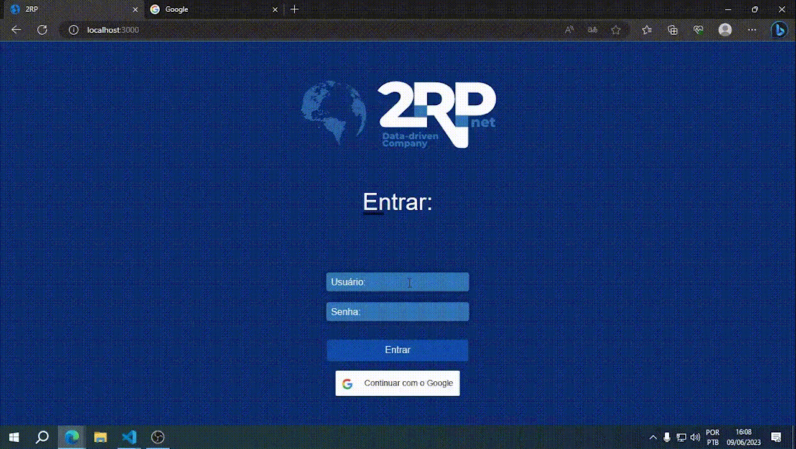

<h1 align="center"> Quarto Semestre - API </h1>

  <a href ="#sobre-o-projeto"> Sobre o projeto  </a>  • 
  <a href ="#telas"> Telas </a>  • 
  <a href ="#requisitos"> Requisitos </a>  • 
  <a href ="#tecnologias-utilizadas"> Tecnologias Utilizadas </a>  •
  <a href ="#contribuições-pessoais"> Contribuições Pessoais </a>  

 

## Sobre o projeto 

No quarto semestre fizemos um Website para controle da jornada de trabalho dos colaboradores.
  
Desenvolvemos um sistema completo, que permitiu o controle da jornada de trabalho de forma detalhada, armazenando-os em um banco de dados para consultas e análises futuras.
  
Ao projetar o Website, dedicamos especial atenção ao design, selecionando cores que remetiam à identidade visual da empresa. Isso não apenas criou uma conexão visual com a marca, mas também transmitiu confiabilidade aos usuários. Além disso, o design foi cuidadosamente elaborado para combinar com o propósito do projeto, resultando em um ambiente intuitivo e amigável para os colaboradores que o utilizam.
  
Estamos satisfeitos em compartilhar que a entrega do projeto foi extremamente bem recebida pelo cliente. Com excelência, cumprimos todas as metas e utilizamos as tecnologias solicitadas de forma eficiente!
  
  

## Telas

<!-- Inicial -->
 

  

  <h4 align="left">Tela Inicial</h4>  
  

  Após realizar o login, o usuário será redirecionado para a <b>página Home</b>, onde encontrará informações relevantes sobre seus últimos apontamentos e as horas trabalhadas. Projetamos essa página para fornecer um resumo claro e conciso das atividades registradas.
       
  Além disso, disponibilizamos botões intuitivos que direcionam o usuário para as páginas de apontamento de horas e visualização dos apontamentos. Essa abordagem simplifica o processo de registro e consulta das informações, tornando a experiência mais eficiente e conveniente para os colaboradores.
    
  

<!-- Páginas de Usuários -->
  

  

   <h4 align="left">Páginas de Usuários</h4>  
  

Na página de <b>Usuários</b>, é possível visualizar uma lista completa dos usuários cadastrados, bem como adicionar novos usuários e editar informações existentes. Essa funcionalidade permite um controle eficiente sobre as contas de acesso e a gestão dos colaboradores da empresa.
  
  

<!-- Centros de Resultados -->
  

  

   <h4 align="left">Centros de Resultados</h4>  
  

Na página de <b>Centros de Resultados</b>, é possível visualizar e gerenciar os centros de resultados cadastrados. Através dessa página, é possível adicionar novos centros de resultados, bem como modificar as informações existentes, garantindo uma gestão eficaz desses elementos importantes para a empresa.
  
  

<!-- Projetos -->
  

  

   <h4 align="left">Tela de Projetos</h4>  
  

Da mesma forma, a página de <b>Projetos</b> oferece uma visão geral dos projetos em andamento, permitindo a inclusão de novos projetos e a edição das informações existentes. Isso facilita o gerenciamento e o acompanhamento do progresso dos projetos em diferentes etapas.
  
  

<!-- Dashboard -->  
 

  

   <h4 align="left">Dashboard</h4>  
  

  
A página <b> Dashboard </b>  é uma das páginas mais importantes da plataforma e apresenta informações de maneira visual e interativa. Utilizamos cores vibrantes e recursos gráficos para destacar as informações relevantes e proporcionar uma experiência mais agradável e intuitiva para os usuários.

Ao clicar em uma unidade específica, a plataforma apresenta informações detalhadas sobre as horas trabalhadas. Além disso, é possível gerar relatórios em PDF com os dados exibidos na página, tornando a análise mais ágil e prática.
  
  
 

<!-- Perfis  -->

  

   <h4 align="left">Perfis</h4>  
  

  
A página de <b> Perfis </b> é onde os administradores da plataforma podem gerenciar os usuários e suas permissões de acesso. É possível visualizar, cadastrar, editar e excluir usuários. Através dessa página, é possível definir qual usuário será um digitador, responsável por inserir as contas, um gestor, que irá aprovar as contas ou um administrador, com acesso total à plataforma. A página também possui uma opção para redefinir as senhas dos usuários, caso necessário. Tudo isso é feito de forma intuitiva e fácil de usar, para garantir um bom gerenciamento dos usuários e permissões.
  
  

<!-- Login  -->

  

   <h4 align="left">Tela de Login</h4>  
  

  
Na página de <b> Login </b> ocorre toda a autentificação do usuário com o direcionamento para as páginas corretas a partir de seu nível de acesso. Buscamos utilizar aqui também as cores principais da marca, como o azul e o branco, de forma a tornar a experiência mais agradável para os usuários do sistema.
  
  

  

  

    

  

 

> Gif da execução completa.

 

## Requisitos 

**Funcionais:** 
✔️ Integração para consumo de dados; 
✔️ Integração com o login 2RP (SSO ou LDAP); 
✔️ Perfis de administrador, gestor e colaborador; 
✔️ Apontamento de horas extras e classificação das horas; 
✔️ Lançamento de horas de sobreaviso; 
✔️ Especificação de cliente, CR (centro de resultado), projeto, solicitante e justificativa; 
✔️ Tela para cadastro de clientes e CRs; 
✔️ Recurso para aprovação de horas extras executadas; 
✔️ Tela de parametrização de sistema; 
✔️ Extração de relatório csv de todos os colaboradores com as horas trabalhadas; 
✔️ Aplicação das regras de horas extras e sobreavisos na extração; 
✔️ Dashboards das horas extras executadas com filtro cliente, CR e colaborador. 

 

**Não Funcionais:** 
✔️ React;  
✔️ NodeJS;  
✔️ Responsividade.

 

> O repositório oficial do projeto pode ser acessado [aqui](https://github.com/Inodevs-4/2RP).

 

## Tecnologias Utilizadas
Ao longo do projeto, trabalhamos com as seguintes ferramentas:
 
   <h4 align="left">Reuniões e Apresentações</h4> 
   
  - **Discord:** Utilizamos para armazenar informações importantes e trabalhar em reuniões;   
  - **WhatsApp:** Para troca de mensagens rápidas e avisos;   
  - **Microsoft Teams:** Para as reuniões com o cliente e visualização da documentação dos requisitos.
 
   <h4 align="left">Data-base</h4>  
 
  - **MySQL:** Utilizamos para gerir o Banco de Dados;

   <h4 align="left">Back-end e  </h4>  
  
  - **NodeJS:** Para nosso Backend;
  - **TypeScript**: Para o desenvolvimento no back com um JS tipado.
  
   <h4 align="left">Front-end </h4>  
 
  - **HTML5:** Para marcar nosso layout e importar os componentes do website; 
  - **CSS3:** Para estilizar nosso site;
  - **JavaScript:** Utilizamos para criar animações em nosso Website;
  - **React:** Utilizamos para facilitar a criação do frontend;

   <h4 align="left">Outros</h4>  
 
  - **Github:** Nosso repositório, onde trabalhamos com o controle de versão;
  - **Visual Studio Code:** Nossa IDE para o desenvolvimento;
  - **Figma:** Para criação do protótipo navegável;
  - **Photoshop:** Para edição das imagens.
 

## Contribuições Pessoais

Neste projeto fui <b>desenvolvedora</b> e pude contribuir bastante com o desenvolvimento do projeto. Por já ter trabalhado com js e similares, não tive grandes dificuldades na aplicação do nosso protótipo para as linguagens escolhidas. Auxiliei no desenvolvimento do projeto, na criação do protótipo, da modelagem do banco de dados e na criação das telas - ajudei em outras tarefas e me mantive a disposição. Gerimos muito bem cada sprint para entregar o melhor em cada fase do desenvolvimento. Além disso, dividimos os times em subgrupos para atingir o resultado final.

## Hard Skills
- **HTML5:** Sei fazer com autonomia; 
- **CSS3:** Sei fazer com autonomia; 
- **TypeScript:** Sei fazer com auxílio de consultas; 
- **Criação de Wireframe com Figma:** Sei fazer com autonomia;  
- **Habilidade de gerenciar o escopo do projeto:** Sei fazer com autonomia;  
- **Utilização do MySQL como Banco de Dados:** Sei fazer com auxílio de consultas;  
- **React:** Sei fazer com auxílio de consultas; 
- **NodeJS :** Sei fazer com auxílio de consultas;  
- **Edição de imagens com Canva:** Sei fazer com autonomia. 

## Soft Skills
 - **Comunicação eficaz:** Busquei me comunicar bem com toda a equipe e expor com clareza as minhas ideais;  
 - **Planejamento:** Gerenciei bem as entregas de cada sprint, pude entregar minhas tarefas no prazo e ajudar como podia;  
 - **Proatividade:** Tive proatividade para aprender as linguagens de programação novas e realizar as tarefas com êxito.  
