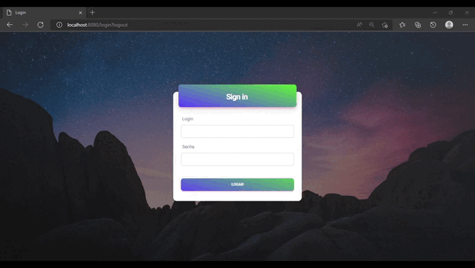

<h1 align="center"> Quarto Semestre - API </h1>

  <a href ="#sobre-o-projeto"> Sobre o projeto  </a>  • 
  <a href ="#telas"> Telas </a>  • 
  <a href ="#requisitos"> Requisitos </a>  • 
  <a href ="#tecnologias-utilizadas"> Tecnologias Utilizadas </a>  •
  <a href ="#contribuições-pessoais"> Contribuições Pessoais </a>  

 

## Sobre o projeto 

No terceiro semestre tivemos uma empresa parceira especializada no controle de contas (água, energia e gás) para terceiros.
  
Nosso objetivo era criar um sistema que ajudasse essa empresa a realizar a coletada e digitação de todos campos para, posteriormente, salvar em seu banco de dados para eventuais consultas e análises técnicas/financeiras desejassem.
  
As cores foram escolhidas para remeter a logo da empresa e gerar confiabilidade aos usuários. Um designer bem pensado para combinar com o foco do projeto. O Website que foi desenvolvido também é intuitivo para os colaboradores que o utilizarão.
  
O cliente gostou bastante da entrega. Entregamos com excelência tudo que nos foi proposto e usamos bem as tecnologias solicitadas. Uma entrega realizada com êxito!

  

## Telas

<!-- Inicial -->
 

  

  <h4 align="left">Tela Inicial com Login</h4>  
  

    Optamos pela escolha do layout da <b> Tela Inicial </b> com 2 colunas para proporcionar uma melhor experiência ao usuário. A coluna principal contém uma imagem de destaque que representa o propósito da plataforma e a segunda coluna possui o campo de login para que apenas usuários autentificados tenham acesso aos recursos disponíveis. 
       
    Essa medida de segurança é necessária para garantir a privacidade dos dados dos usuários e oferecer uma navegação mais confiável e eficiente. Além disso, desenvolvemos um website intuitivo para facilitar a utilização da plataforma desde a primeira interação.
    
  

  
<!-- Tabela de Contas -->
  

  

   <h4 align="left">Tabela de Contas</h4>  
  

  
A <b>Tabela de Contas</b> lista todas as contas coletadas pela empresa (água, energia e fás) e permite filtragem, busca e exportação dos dados. Uma vez que o usuário encontra a conta desejada, é possível acessar todas as informações digitadas no momento da coleta, como nome do cliente, endereço, consumo de energia, água ou gás, entre outras informações.    
Para tornar a página de Tabela de Contas mais interativa e atraente, optamos por utilizar uma interface visual intuitiva e de fácil navegação. Utilizamos elementos gráficos como cores, ícones e botões para destacar as funcionalidades da página e facilitar a compreensão dos usuários.
  
  

<!-- Dashboard -->  
 

  

   <h4 align="left">Dashboard</h4>  
  

  
A página <b> Dashboard </b>  é uma das páginas mais importantes da plataforma e apresenta informações de maneira visual e interativa. Utilizamos cores vibrantes e recursos gráficos para destacar as informações relevantes e proporcionar uma experiência mais agradável e intuitiva para os usuários.

Ao clicar em uma unidade específica, a plataforma apresenta informações detalhadas sobre o consumo e despesas do contrato com a concessionária, além de alertas automáticos em caso de consumo elevado. Além disso, é possível gerar relatórios em PDF com os dados exibidos na página, tornando a análise mais ágil e prática.
  
  
 

<!-- Cadastro -->

 
 
  

   <h4 align="left">Cadastro </h4>  
  

 
A tela de <b> Cadastro </b> temos alguns formulários que foram desenvolvidos com uma interface clara e objetiva, afim de facilitar o preenchimento dos dados e garantindo a integridade das informações. Temos nessa página diferentes opções de formulários para cadastrar contas, concessionárias, unidades e contratos, que são organizados de forma intuitiva e prática para facilitar a navegação.
  
É a partir desse cadastro que definimos as rotas de cada perfil. Nosso login explicado acima possui autentificação e cada usuário só terá acesso as telas necessárias para seu trabalho, seja ele Digitador - quem escreverá as contas - Gestor - quem as aprovará - ou Administrador - quem tem controle de tudo na plataforma.

 

   
<!-- Histórico  -->
 

  

   <h4 align="left">Histórico</h4>  
  

  
Na tela <b> Histórico </b> é possível encontrar informações detalhadas sobre quais dados de cadastro foram adicionados, alterados ou excluídos, juntamente com o nome do usuário responsável e a data em que a ação foi realizada. Essa funcionalidade garante maior transparência e controle sobre as operações realizadas no sistema, permitindo uma melhor análise e rastreamento de qualquer alteração ou atualização feita no banco de dados.
  
  

<!-- Perfis  -->

  

   <h4 align="left">Perfis</h4>  
  

  
A página de <b> Perfis </b> é onde os administradores da plataforma podem gerenciar os usuários e suas permissões de acesso. É possível visualizar, cadastrar, editar e excluir usuários. Através dessa página, é possível definir qual usuário será um digitador, responsável por inserir as contas, um gestor, que irá aprovar as contas ou um administrador, com acesso total à plataforma. A página também possui uma opção para redefinir as senhas dos usuários, caso necessário. Tudo isso é feito de forma intuitiva e fácil de usar, para garantir um bom gerenciamento dos usuários e permissões.
  
  

  

  

    

    

  

                        
> Gif da execução completa.

 

## Requisitos 

**Funcionais:** 
✔️ Integração para consumo de dados; 
✔️ Integração com o login 2RP (SSO ou LDAP); 
✔️ Perfis de administrador, gestor e colaborador; 
✔️ Apontamento de horas extras e classificação das horas; 
✔️ Lançamento de horas de sobreaviso; 
✔️ Especificação de cliente, CR (centro de resultado), projeto, solicitante e justificativa; 
✔️ Tela para cadastro de clientes e CRs; 
✔️ Recurso para aprovação de horas extras executadas; 
✔️ Tela de parametrização de sistema; 
✔️ Extração de relatório csv de todos os colaboradores com as horas trabalhadas; 
✔️ Aplicação das regras de horas extras e sobreavisos na extração; 
✔️ Dashboards das horas extras executadas com filtro cliente, CR e colaborador. 

 

**Não Funcionais:** 
✔️ React;  
✔️ NodeJS;  
✔️ Responsividade.

 

> O repositório oficial do projeto pode ser acessado [aqui](https://github.com/Inodevs-4/2RP).

 

## Tecnologias Utilizadas
Ao longo do projeto, trabalhamos com as seguintes ferramentas:
 
   <h4 align="left">Reuniões e Apresentações</h4> 
   
  - **Discord:** Utilizamos para armazenar informações importantes e trabalhar em reuniões;   
  - **WhatsApp:** Para troca de mensagens rápidas e avisos;   
  - **Microsoft Teams:** Para as reuniões com o cliente e visualização da documentação dos requisitos.
 
   <h4 align="left">Data-base</h4>  
 
  - **MySQL:** Utilizamos para gerir o Banco de Dados;

   <h4 align="left">Back-end e  </h4>  
  
  - **NodeJS:** Para nosso Backend;
  - **TypeScript**: Para o desenvolvimento no back com um JS tipado.
  
   <h4 align="left">Front-end </h4>  
 
  - **HTML5:** Para marcar nosso layout e importar os componentes do website; 
  - **CSS3:** Para estilizar nosso site;
  - **JavaScript:** Utilizamos para criar animações em nosso Website;
  - **React:** Utilizamos para facilitar a criação do frontend;

   <h4 align="left">Outros</h4>  
 
  - **Github:** Nosso repositório, onde trabalhamos com o controle de versão;
  - **Visual Studio Code:** Nossa IDE para o desenvolvimento;
  - **Figma:** Para criação do protótipo navegável;
  - **Photoshop:** Para edição das imagens.
 

## Contribuições Pessoais

Neste projeto fui <b>desenvolvedora</b> e pude contribuir bastante com o desenvolvimento do projeto. Por já ter trabalhado com js e similares, não tive grandes dificuldades na aplicação do nosso protótipo para as linguagens escolhidas. Auxiliei no desenvolvimento do projeto, na criação do protótipo, da modelagem do banco de dados e na criação das telas - ajudei em outras tarefas e me mantive a disposição. Gerimos muito bem cada sprint para entregar o melhor em cada fase do desenvolvimento. Além disso, dividimos os times em subgrupos para atingir o resultado final.

## Hard Skills
- **HTML5:** Sei fazer com autonomia; 
- **CSS3:** Sei fazer com autonomia; 
- **TypeScript:** Sei fazer com auxílio de consultas; 
- **Criação de Wireframe com Figma:** Sei fazer com autonomia;  
- **Habilidade de gerenciar o escopo do projeto:** Sei fazer com autonomia;  
- **Utilização do MySQL como Banco de Dados:** Sei fazer com auxílio de consultas;  
- **React:** Sei fazer com auxílio de consultas; 
- **NodeJS :** Sei fazer com auxílio de consultas;  
- **Edição de imagens com Canva:** Sei fazer com autonomia. 

## Soft Skills
 - **Comunicação eficaz:** Busquei me comunicar bem com toda a equipe e expor com clareza as minhas ideais;  
 - **Planejamento:** Gerenciei bem as entregas de cada sprint, pude entregar minhas tarefas no prazo e ajudar como podia;  
 - **Proatividade:** Tive proatividade para aprender as linguagens de programação novas e realizar as tarefas com êxito.  
