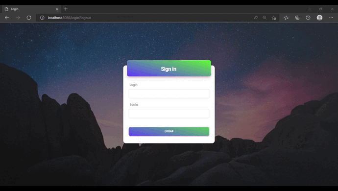

<h1 align="center"> Terceiro Semestre - API </h1>

  <a href ="#sobre-o-projeto"> Sobre o projeto  </a>  • 
  <a href ="#telas"> Telas </a>  • 
  <a href ="#requisitos"> Requisitos </a>  • 
  <a href ="#tecnologias-utilizadas"> Tecnologias Utilizadas </a>  •
  <a href ="#contribuições-pessoais"> Contribuições Pessoais </a>  

 

## Sobre o projeto 

No terceiro semestre tivemos uma empresa parceira especializada no controle de contas (água, energia e gás) para terceiros.
  
Nosso objetivo era criar um sistema que ajudasse essa empresa a realizar a coletada e digitação de todos campos para, posteriormente, salvar em seu banco de dados para eventuais consultas e análises técnicas/financeiras desejassem.
  
As cores foram escolhidas para remeter a logo da empresa e gerar confiabilidade aos usuários. Um designer bem pensado para combinar com o foco do projeto. O Website que foi desenvolvido também é intuitivo para os colaboradores que o utilizarão.
  
O cliente gostou bastante da entrega. Entregamos com excelência tudo que nos foi proposto e usamos bem as tecnologias solicitadas. Uma entrega realizada com êxito!

  

## Telas

<!-- Inicial -->
 

  

  <h4 align="left">Tela Inicial com Login</h4>  
  

    Optamos pela escolha do layout da <b> Tela Inicial </b> com 2 colunas para proporcionar uma melhor experiência ao usuário. A coluna principal contém uma imagem de destaque que representa o propósito da plataforma e a segunda coluna possui o campo de login para que apenas usuários autentificados tenham acesso aos recursos disponíveis. 
       
    Essa medida de segurança é necessária para garantir a privacidade dos dados dos usuários e oferecer uma navegação mais confiável e eficiente. Além disso, desenvolvemos um website intuitivo para facilitar a utilização da plataforma desde a primeira interação.
    
<!--

<!-- Sobre Nós 
  

  

   <h4 align="left">Tela Sobre Nós</h4>  
  

  
A tela <b> Sobre Nós </b> foi criada com o propósito de informar os usuários sobre a história da ONG, seu propósito e sua transparência em relação às suas atividades e financiamentos. Através dessa tela, os usuários podem conhecer mais sobre a organização e entender seus objetivos e valores, o que ajuda a construir uma relação de confiança com o público.  

Além disso, enfatizamos a transparência da ONG em relação às suas atividades e financiamentos, a fim de transmitir uma imagem de credibilidade e confiança para os usuários. Por isso, a tela "Sobre Nós" foi desenvolvida de forma clara e objetiva, com informações relevantes e de fácil acesso para os usuários, permitindo que eles conheçam a fundo a organização e sua missão com imagens para tornar tudo mais claro em uma coluna única.
  
  
-->

  <!-- Ajude
  
  

  

   <h4 align="left">Tela Ajude</h4>  
  

  
Na tela <b> Ajude </b> criamos um lugar dedicado para a realização de doações. Nós sabemos que muitos usuários podem estar interessados em ajudar a ONG de alguma forma, e por isso, quisemos tornar esse processo o mais simples e fácil possível.  

Nessa tela, os usuários podem encontrar informações sobre como fazer doações e também uma área para preencher seus dados e efetivar a doação. Com essa tela, esperamos incentivar mais pessoas a contribuírem com a ONG e tornar o processo de doação mais acessível para todos em uma coluna única.
  
  
 -->
<!--
  

      Projeto 
  

   <h4 align="left">Tela Projetos</h4>  
  

 
Para a tela <b> Projetos </b>, optamos por apresentar uma visualização clara e organizada de todos os projetos realizados pela ONG. Cada projeto possui uma foto e uma descrição detalhada, permitindo que o usuário entenda facilmente o que cada projeto representa e como ele pode contribuir.

Além disso, adicionamos uma aba de busca para tornar mais fácil para os usuários encontrar projetos específicos que possam ser de seu interesse. Dessa forma, garantimos que o usuário possa explorar facilmente a variedade de projetos realizados pela ONG e encontrar maneiras de se envolver e contribuir para a causa em uma coluna única.
  
 -->

   
   
 <!-- 

       login 
  

   <h4 align="left">Tela Login</h4>  
  

  
A tela <b> Login </b> foi criada para permitir a autenticação de usuários Admin, que tivessem acesso privilegiado para editar as informações postadas na plataforma. Além disso, essa tela também foi desenvolvida também para os alunos que puderam acessar materiais de auxílio e outras informações relevantes.  

Essa tela foi fundamental para garantir que apenas usuários autorizados tenham acesso às informações e recursos da plataforma, além de permitir uma melhor organização e gerenciamento dos conteúdos postados pela ONG. Foi pensada também em fornecer as informações na tela de maneira intuitiva para uma melhor experiência ao usuário.
  
  
-->

  

  

    

    

  

                        
> Gif da execução completa.

 

## Requisitos 

**Funcionais:** 
✔️ Cadastros de Unidades, Concessionárias, Contratos;  
✔️ Cadastro do usuário e seus perfis (administrador, gestor e digitador);  
✔️ Cadastro (digitação) da conta de água, energia e gás;  
✔️ Registro de log de operações (cadastro e deleção);  
✔️ Relatório de consumo total de água mensal, anual e média;  
✔️ Geração de alertas de consumo acima da média (a média pode ser definida no cadastro do contrato).

 

**Não Funcionais** 
✔️ Prezar pelo UX da tela de digitação das contas;  
✔️ Incluir atalhos no teclado;  
✔️ Permitir navegação entre campos por TAB ou seta.
 
> O repositório oficial do projeto pode ser acessado [aqui](https://github.com/NewInoDevs/NewInoDevsx).

 

## Tecnologias Utilizadas
Ao longo do projeto, trabalhamos com as seguintes ferramentas:
 
   <h4 align="left">Reuniões e Apresentações</h4> 
   
  - **Discord:** Utilizamos para armazenar informações importantes e trabalhar em reuniões;   
  - **WhatsApp:** Para troca de mensagens rápidas e avisos;   
  - **Microsoft Teams:** Para as reuniões com o cliente e visualização da documentação dos requisitos.
 
   <h4 align="left">Data-base</h4>  
 
   - **MySQL:** Utilizamos em nosso Banco de Dados para armazenar e alterar os dados. 

   <h4 align="left">Back-end </h4>  
  
  - **Java:** Utilizamos para manipular o Banco de Dados;
  - **Spring:** Utilizamos para facilitar o desenvolvimento da aplicação
  
   <h4 align="left">Front-end </h4>  
 
  - **HTML5:** Para marcar nosso layout e importar os componentes do website; 
  - **CSS3:** Para estilizar nosso site;
  - **JavaScript:** Utilizamos para criar animações em nosso Website;
  - **Bootstrap:** Utilizamos para facilitar a criação do frontend.
  
   <h4 align="left">Outros</h4>  
 
  - **Github:** Nosso repositório, onde trabalhamos com o controle de versão;
  - **Visual Studio Code:** Nossa IDE para o desenvolvimento;
  - **Figma:** Para criação do protótipo navegável;
  - **Photoshop:** Para edição das imagens.
 

## Contribuições Pessoais

Neste projeto fui <b>Product Owner</b>. Compreendi a necessidade do cliente e repassei ao time. Além disso, minha função envolveu a definição e gerenciamento das user stories e do backlog, bem como a compreensão clara do MVP (Minimum Viable Product) de cada entrega. Trabalhei próxima ao time de desenvolvimento para garantir que o trabalho estivesse sempre alinhado com as necessidades do cliente e as prioridades do projeto. Cuidei também para que o cliente estivesse ciente de quaisquer mudanças ou ajustes necessários, a fim de garantir a transparência e a confiança em nosso trabalho

## Hard Skills
- **Conceitos aplicados de UX Designer:** Sei fazer com autonomia; 
- **Habilidade em gerenciamento de backlog:** Sei fazer com autonomia; 
- **Criação de Wireframe com Figma:** Sei fazer com autonomia;  
- **Habilidade de gerenciar o escopo do projeto:** Sei fazer com autonomia;  
- **Utilização do MySQL como Banco de Dados:** Sei fazer com auxílio de consultas;  
- **Manipulação de entradas com Java:** Sei fazer com auxílio de consultas; 
- **Dominio de HTML5:** Sei fazer com autonomia;  
- **Dominio de CSS3:** Sei fazer com autonomia;  
- **Edição de imagens com Canva:** Sei fazer com autonomia. 

## Soft Skills
 - **Comunicação eficaz:** Comuniquei-me de forma clara e assertiva;  
 - **Planejamento:** Gerenciei o Backlog para realizar bem as entregas dentro de cada sprint;  
 - **Organização:** Entreguei tudo de forma bem organizada e clara;  
 - **Autonomia:** Realizei bem as atividades e em quais tive dificuldade, aprendi com autonomia;  
 - **Gestão de tempo:** Boa manipulação do burndown, lidamos com o tempo a nosso favor;  
 - **Colaboração:** Todos se auxiliaram, ajudei em tudo que pude e ensinei o que sabia.  
